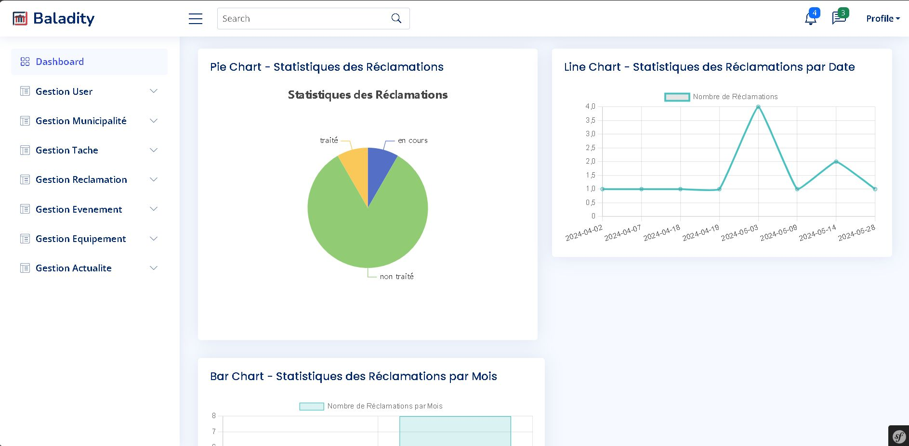

# Baladity Web

Baladity is a cutting-edge application designed to bridge the communication gap between citizens and their local municipal authorities. Our platform empowers both citizens and municipal employees by providing a streamlined, efficient means of interaction and task management.

## Here is the demo of our application: [Baladity](https://www.youtube.com/watch?v=_SEiQ2j_JvM)

## Cross Platform:
1) [Web](https://github.com/louatiakram/Baladity_Web)
2) [Mobile](https://github.com/louatiakram/Baladity_Mobile)
3) [Desktop](https://github.com/louatiakram/Baladity_Desktop)

### Prerequisites

- PHP 8.0 or higher
- Composer
- Symfony CLI
- MySQL
- Git

### Installation

1. Clone the repository:
   ```sh
   git clone https://github.com/louatiakram/Baladity_Web.git
   ```
   
2. Install Dependencies:
   ```sh
   composer install
   ```

3. Database Migration:
   ```sh
   symfony console doctrine:database:create
   symfony console doctrine:migrations:migrate
   ```

4. Run the Server:
   ```sh
   symfony serve
   ```
## Here are some screenshots of our application:

<p align="center">
 
 
 
 
</p>

## TOP 12 BAL PI 2024:

<p align="center">
 
 
</p>
